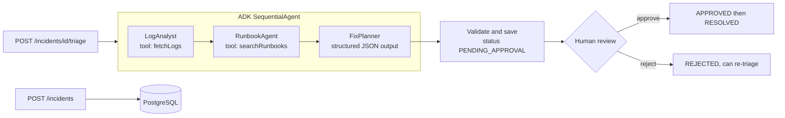

# OpsPilot: multi-agent incident triage

OpsPilot takes a production incident, sends it through a pipeline of AI agents built with
**Google ADK for Java**, and returns a root cause and a step-by-step fix plan. A human must
approve the plan before anything happens.

**Stack:** Java 21 · Spring Boot 4 · Google ADK 1.7 (Gemini) · PostgreSQL · JPA/Hibernate · Docker · GitHub Actions

## How it works



1. **LogAnalyst** calls the `fetchLogs` tool and summarises the errors. Its answer goes into session state as `log_findings`.
2. **RunbookAgent** reads `{log_findings}`, calls `searchRunbooks` (retrieval over the team's runbooks) and writes `runbook_context`.
3. **FixPlanner** combines both and must reply in a fixed JSON schema: `rootCause`, `fixSteps`, `confidence`, `runbookUsed`.
4. The backend validates that JSON (it doesn't trust model output blindly), stores it, and waits for a human.

### ADK concepts used
| Concept | Where |
|---|---|
| `LlmAgent` with instructions | `AdkTriageEngine.buildPipeline` |
| Custom function tools (`FunctionTool`, `@Schema`) | `LogTools`, `RunbookTools` |
| Workflow agent (`SequentialAgent`) | the 3-step pipeline |
| Shared session state (`outputKey` + `{placeholders}`) | passing results between agents |
| Structured output (`outputSchema`) | `FixPlanner` |
| Runner and sessions (`InMemoryRunner`) | one fresh session per triage |

### Engineering choices
- **Human-in-the-loop:** the status machine (`OPEN → PENDING_APPROVAL → APPROVED/REJECTED → RESOLVED`) is enforced in the service layer, and invalid transitions return `409 Conflict`.
- **Safe tools:** service names are validated with a strict pattern, so the model can't make the log tool read arbitrary files.
- **Testable AI:** the AI sits behind a `TriageEngine` interface, so API tests mock it and run offline with no API key.
- **No long DB transactions:** the slow LLM call runs outside a transaction.

## Web console
Open **http://localhost:8080** for the incident console: create incidents, run the AI triage, and **approve or reject** the proposed fix with one click. It is a single static page (`src/main/resources/static/index.html`) served by Spring Boot that calls the REST API below. All AI text is rendered as plain text (no `innerHTML`), so model output can't inject scripts.

## API
| Method | Path | Purpose |
|---|---|---|
| POST | `/api/incidents` | Create an incident |
| GET | `/api/incidents?status=` | List incidents, optionally by status |
| GET | `/api/incidents/{id}` | Get one incident |
| POST | `/api/incidents/{id}/triage` | Run the AI agents |
| POST | `/api/incidents/{id}/approve` | Approve the proposed fix |
| POST | `/api/incidents/{id}/reject` | Reject it (can be triaged again) |
| POST | `/api/incidents/{id}/resolve` | Mark resolved |

Example requests are in [`requests.http`](requests.http).

## Run locally
Prerequisites: Java 21, Maven 3.9+, Docker, and a Gemini API key from https://aistudio.google.com/apikey

```bash
docker compose up -d postgres            # start PostgreSQL
export GOOGLE_API_KEY=your-key           # Windows PowerShell: $env:GOOGLE_API_KEY="your-key"
mvn spring-boot:run
```

Or run everything in Docker:
```bash
cp .env.example .env   # add your key
docker compose --profile app up --build
```

Run the tests (no key or database needed): `mvn test`

## Demo scenarios
Sample logs and runbooks are included for three services:

| serviceName | What's wrong |
|---|---|
| `payment-service` | DB connection pool exhausted by a slow, unindexed query |
| `order-service` | Nightly export job causes OutOfMemoryError and OOMKilled pods |
| `auth-service` | Expired TLS certificate on the identity provider |

## Roadmap
- [ ] Semantic runbook search with embeddings and pgvector
- [ ] Real log sources through an MCP tool (Kubernetes / CloudWatch)
- [ ] Spring Security with JWT and roles (only on-call leads can approve)
- [ ] ADK evaluation set to measure root-cause accuracy
- [ ] Async triage with status polling
- [ ] Deploy to Cloud Run
